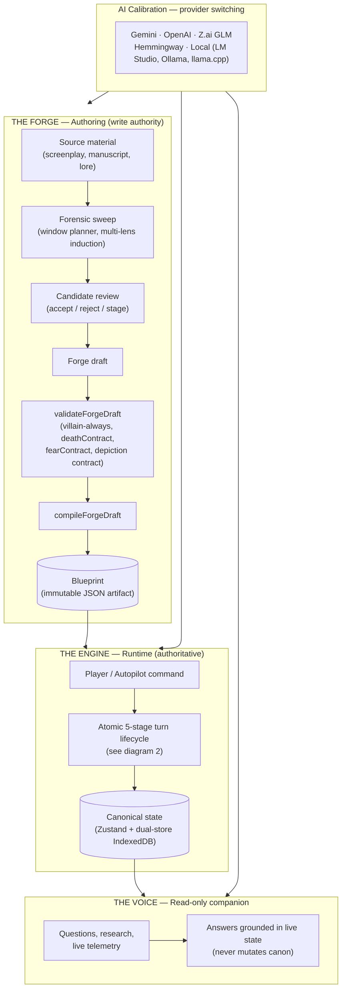
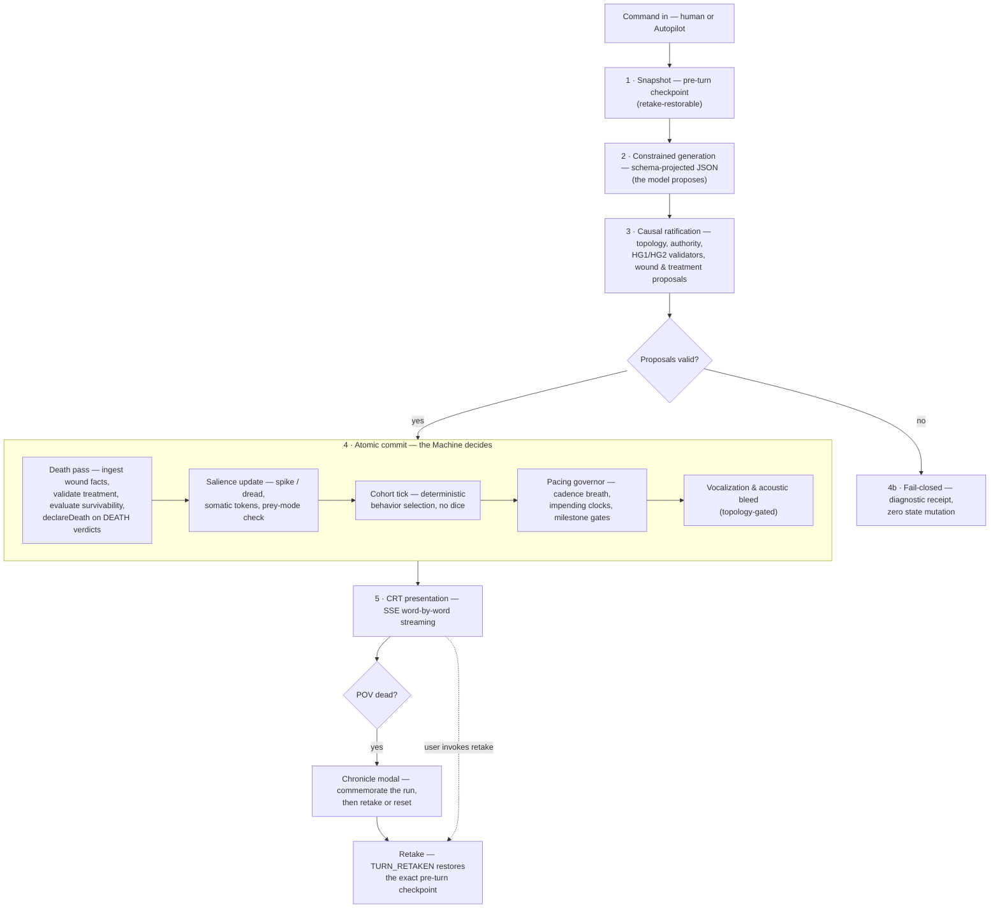
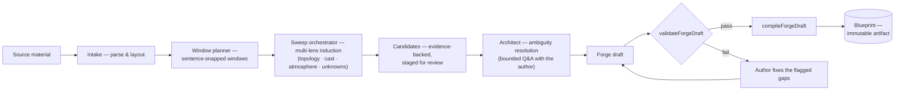

# The Terror Machine — System Flowchart

How the machine fits together: the three nodes, the atomic turn, and the Forge pipeline.
Diagrams are [Mermaid](https://mermaid.js.org/) — GitHub renders them natively.

---

## 1. System overview — the three nodes

**Reading it:** The Forge turns source material into an immutable Blueprint. The Engine runs the Blueprint — the model proposes, the machine decides, and canonical state persists across turns and reloads. The Voice reads that state to explain receipts and contradictions but can never change it. Every subsystem can point at a different provider through AI Calibration; the contracts stay identical.

---

## 2. The atomic turn — one command, one commit or fail-closed

**Reading it:** Every turn is all-or-nothing. The machine snapshots first, so retake can always unwind to the exact pre-turn state. Generation is schema-constrained; ratification rejects anything that violates topology, authority, or causal law. The commit runs the deterministic subsystem passes in order — death, fear, cohort, pacing, voice — then the result streams to the CRT. If the POV character died, the run terminates into a Chronicle; death never seals the retake window.

---

## 3. The Forge pipeline — source material to immutable Blueprint

**Compile gates** (all must pass — the compiler fails with a named error otherwise):

| Gate | Rule |
| :--- | :--- |
| Villain-always | Cast must contain at least one `VILLAIN` |
| `deathContract` | Required on every blueprint (`powerBudget` + `deathMetaphysics`; `seatSuccession` for cohort scenarios) |
| `fearContract` | Required on every blueprint (fearlessness, threat weights, somatic bands, submit responses, …) |
| Depiction contract | Strict contract shaping framing and directness |
| Topology closure | Spaces form a valid directed graph; movement needs authorized edges |

---

## Contracts the Engine enforces at runtime

Authored in the Forge, enforced by the machine — never the other way around:

- **`deathContract`** — the scenario's physics of dying: power budget, death metaphysics, per-seat succession.
- **`fearContract`** — the scenario's psychology of terror: fearlessness, mortality belief, threat weights, somatic bands, release valves, villain gaze authorization, submit responses.
- **Depiction contract** — how directly the scenario may be rendered; shapes framing, grants no causal authority.
- **Authority contracts** — what each entity is allowed to do; a thought-only antagonist gets no physical reach unless the contract grants it.
